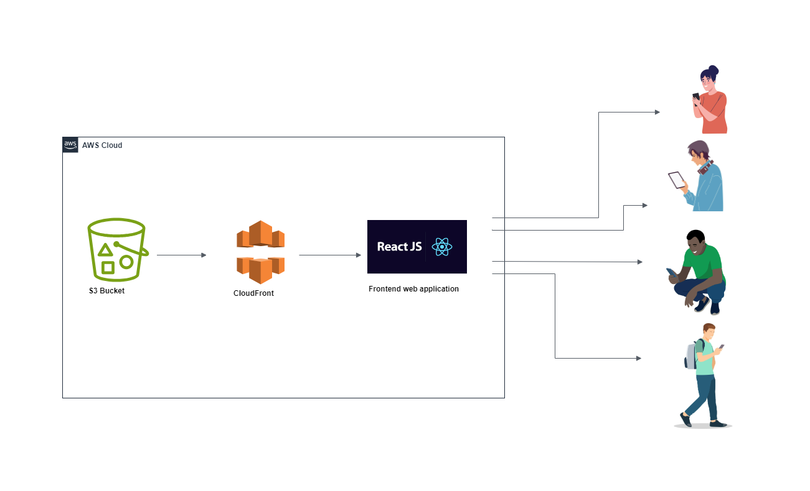

## Building serverless video streaming using S3 Bucket CloudFront ReactJS

Introduction

Have you ever been curious about the technology behind streaming videos on platforms like YouTube,NetFlix, and Facebook? In this project, we build a simple serverless video streaming service using S3 Bucket, CloudFront and ReactJS to create a frontend web application.
we're going to design and implement a serverless architecture for a service. Our system will enable users to upload videos, which we will then convert to HTTP Live Streaming (HLS) format, ensuring compatibility across all HLS-supported video players.

## What We will do

In this guide, We will:

- Create and setup an Amazon CloudFront
- Integrate CloudFront with Amazon S3 Bucket
- Distribute video into web application using ReactJS

## Requirements

Before Starting this guide,you will need:

- An AWS account (if you don't yet have one, please create one and [set up your environment](https://aws.amazon.com/getting-started/guides/setup-environment/))
- An IAM user that has the access and create AWS resources.
- Basic understanding of Javascript

1. -Architecture

1.1 Crerate S3 Bucket with no public access , enable versionning
1.2 Create origin access before creating cloudFront
1.3 Create the distribution

2. Create ReactJS web application

a- Inside project directory do `npx create-react-app serverless-streaming-service`
b- Go to the rectJS project `cd serverless-streaming-service`
c- Start application using `npm start `

TO BE CONTINUED !
