## Building serverless video streaming using S3 Bucket CloudFront ReactJS


Introduction

Have you ever been curious about the technology behind streaming videos on platforms like YouTube,NetFlix, and Facebook? In this project, we build a simple serverless video streaming service using S3 Bucket, CloudFront and ReactJS to create a frontend web application.
we're going to design and implement a serverless architecture for a service. Our system will enable users to upload videos, which we will then convert to HTTP Live Streaming (HLS) format, ensuring compatibility across all HLS-supported video players.

## What We will do

In this guide, We will:

- Create and setup an Amazon CloudFront
- Integrate CloudFront with Amazon S3 Bucket
- Distribute video into web application using ReactJS

## Requirements

Before Starting this guide,you will need:

- An AWS account (if you don't yet have one, please create one and [set up your environment](https://aws.amazon.com/getting-started/guides/setup-environment/))
- An IAM user that has the access and create AWS resources.
- Basic understanding of Javascript

## 1. Architecture

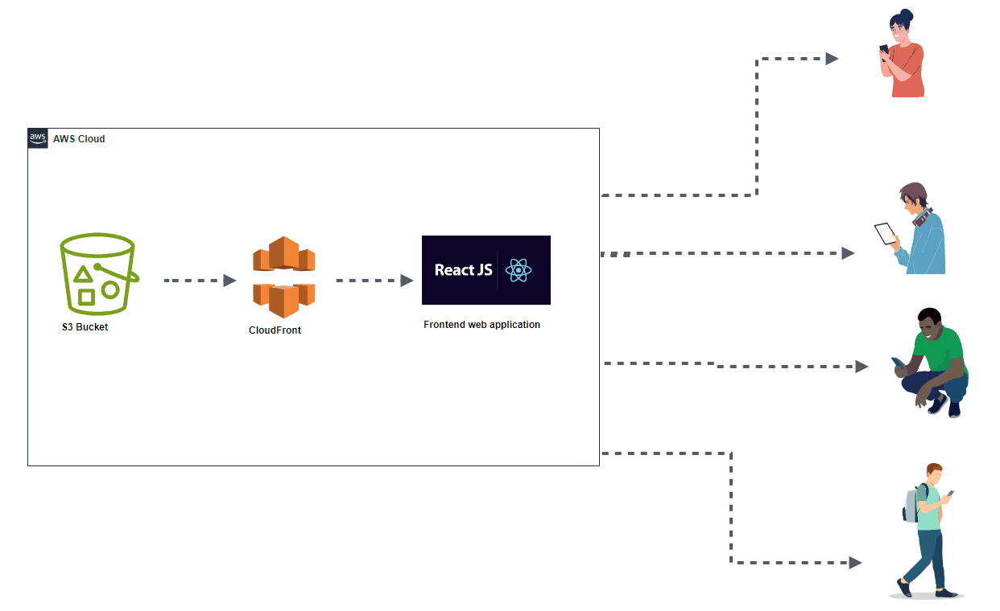 

 <br />

1.1 Crerate S3 Bucket with no public access and enable versionning enabled

 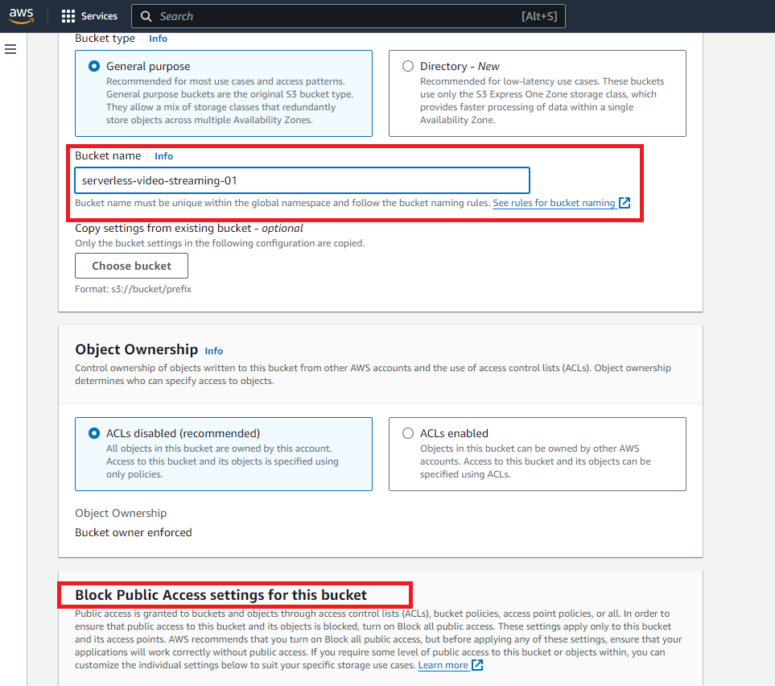 


 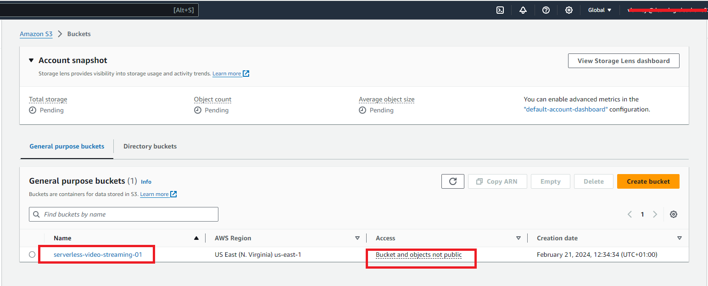 

 <br />

1.2 Create origin access before creating CloudFront


- From left corner click on symbol

 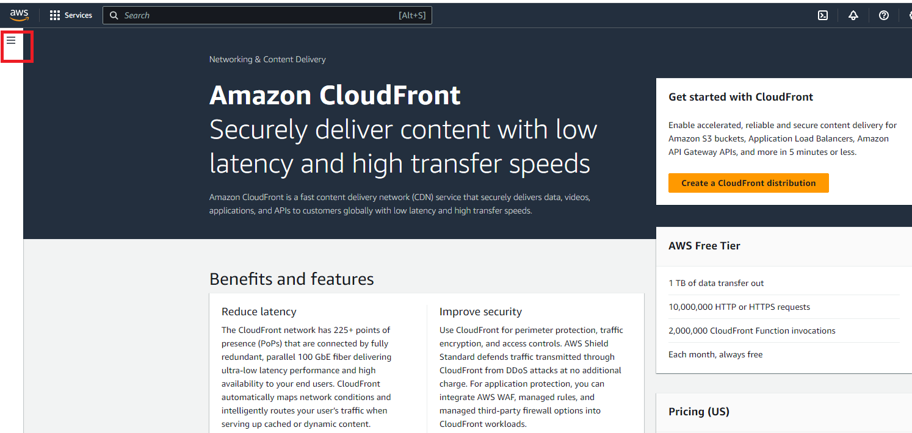 

 
- Click on Origin access and create control setting.
  
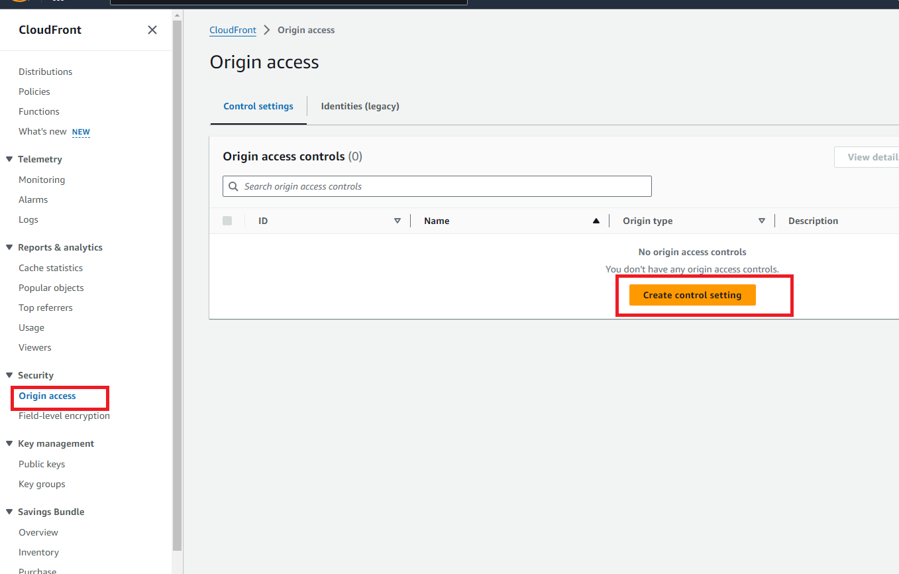

- Give a name, choose origin type as S3 and click on create.
  
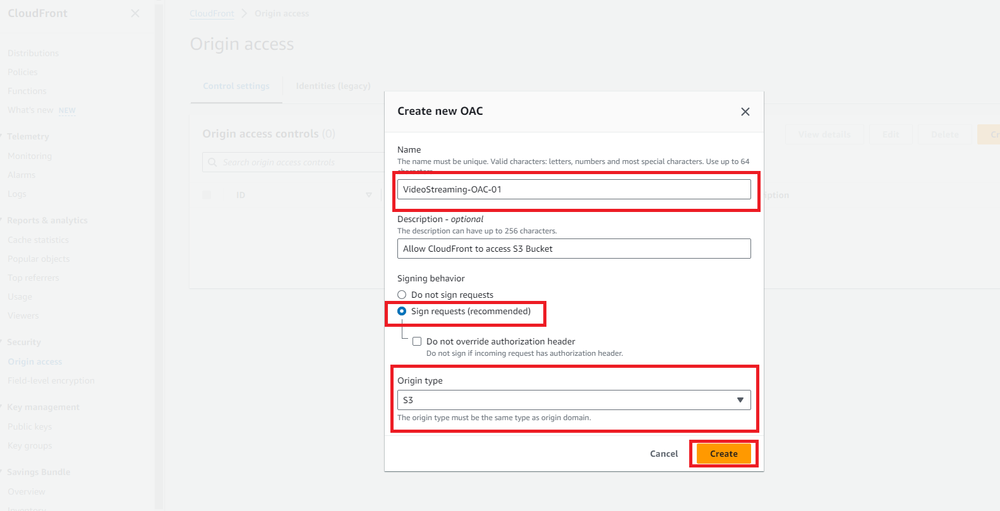 

1.3 Create the distribution

- From left corner click on Distributions
  
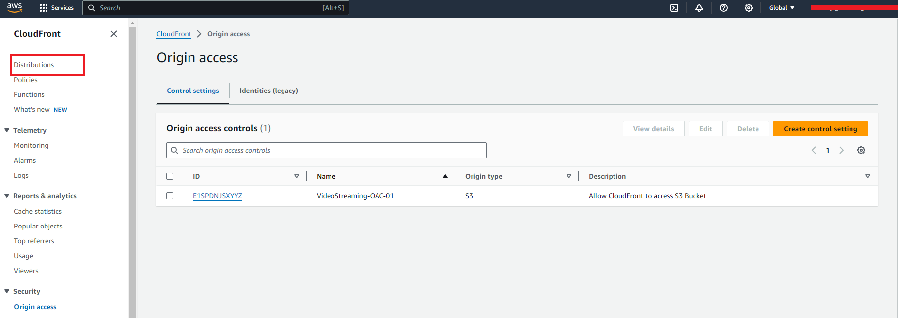

- Choose origin domain , give a name,  origin access control settings as recommended and origin access control created before  

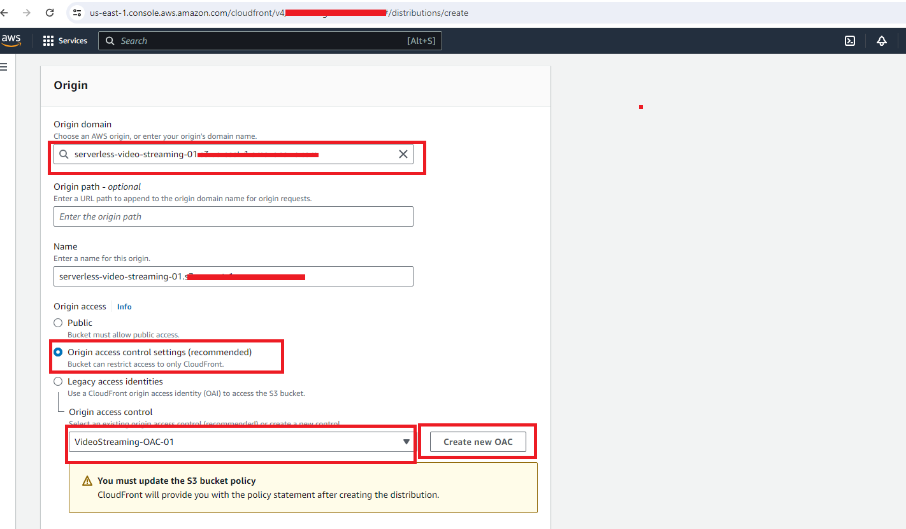
- Choose redirect HTTP to HTTPS 
  
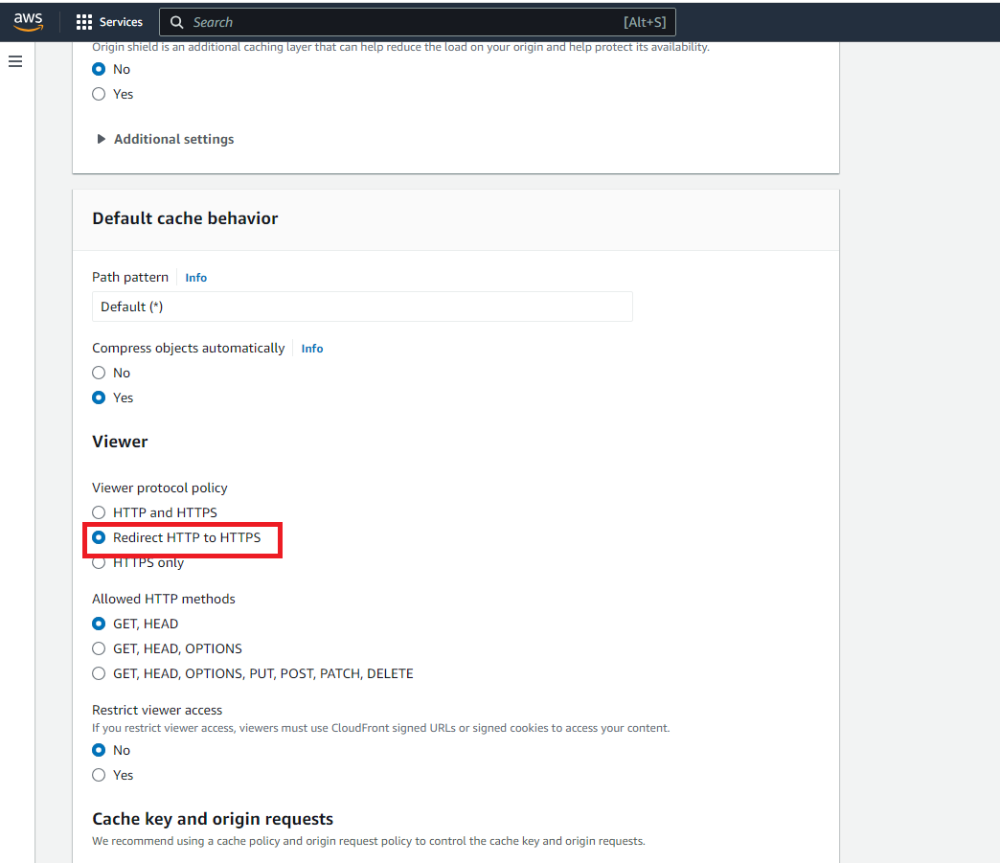

- Choose Do not enable security protections from WAF
  
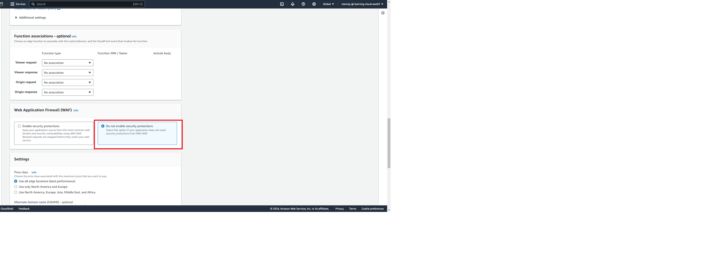

- Click on create distribution to create the distribution
  
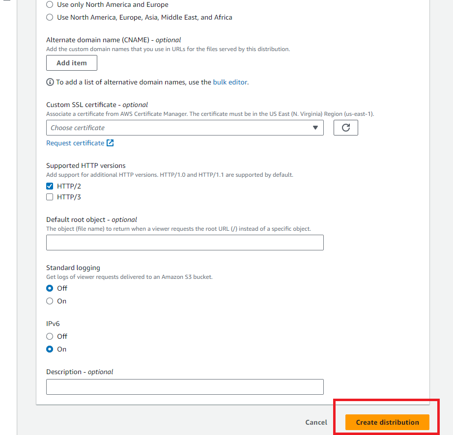


- After creating the distribution cloudfront will deployed. Copy the given policy.
  

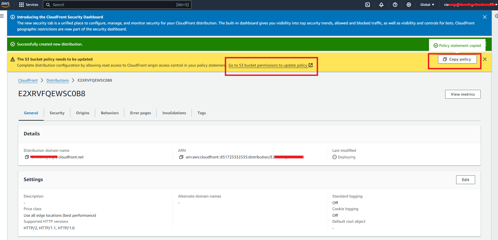

- Paste the policy to S3 bucket policy; it allows Cloudfront to have access to S3 Bucket.
  

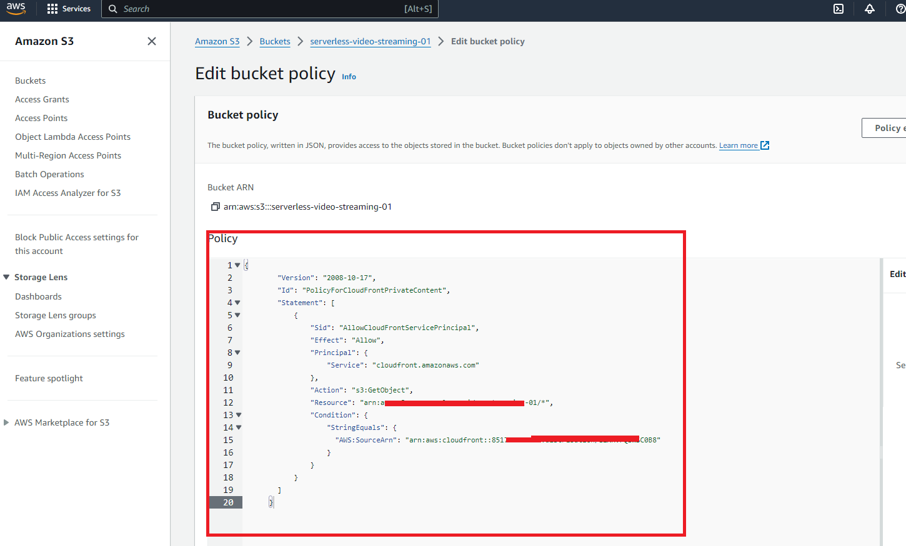


- Copy CloudFront URL , paste in the browser add / and copy and paste S3 bucket object key 
 

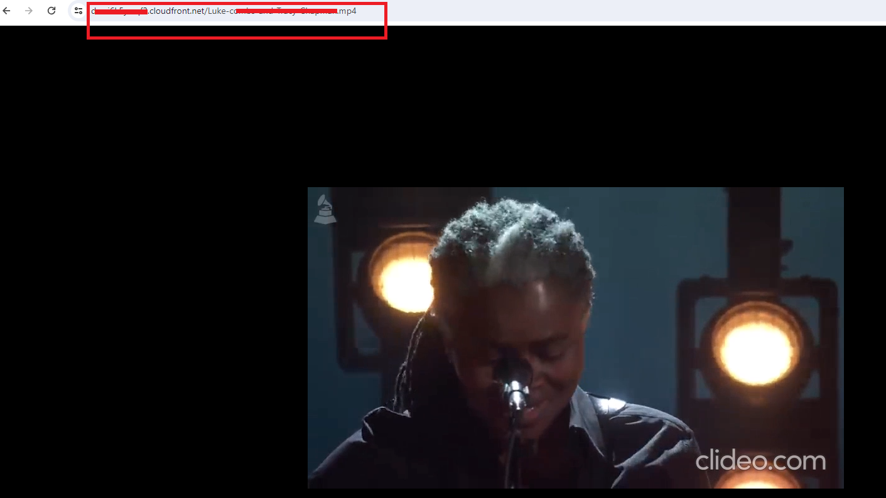


## 2. Create ReactJS web application <br />
   
 Here we create a simple web application and added cloudfront URL to our page.

-  Inside project directory do <br/>
   ```bash
    npx create-react-app serverless-streaming-service
   ```
- Go to the ReactJS project <br/>
    ```bash
   cd serverless-streaming-service
   ```
- Start application using <br/>

    ```bash
    npm start
    ```
Update App.js file by adding cloudfront URL

  ```bash 
    function App() {
    return (
        <div className="App">
        <h2>Welcome to serverless video streaming service </h2>
        <video width={700} height={400} controls>
            <source src="https://dmsi7k9yxrqf3.cloudfront.net/Luke-combs-and-Tracy-Chapman.mp4"
            type='video/mp4' />
            
        </video>
        </div>
    );
    }

    export default App;
```
Now go to the browser and write
```bash 
   localhost:3000
```

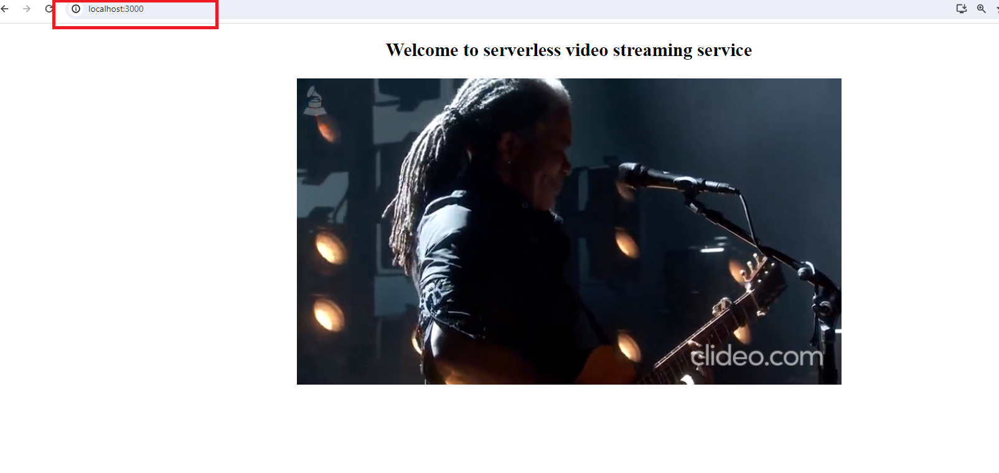

Here is the CloudFront Statistics 

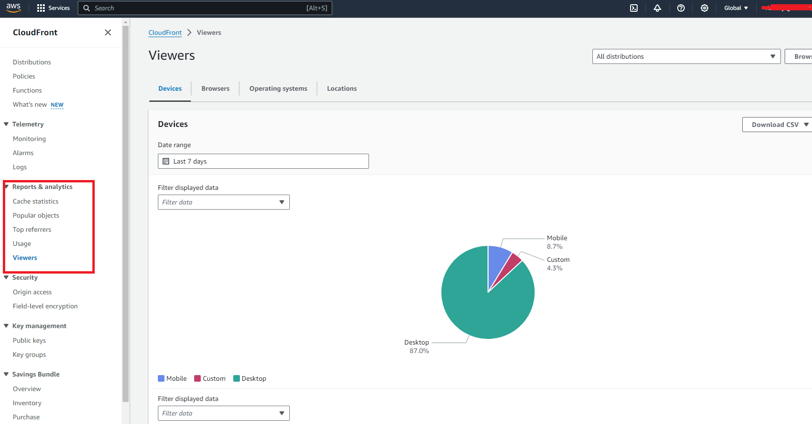

## 3. Conclusion <br />

Congratulations! You have finished the Creating serverless video streaming service using S3 Bucket, CloudFront and ReactJS.

##  4. Clean up

- Delete S3 Bucket
- Disable Distribution from CloudFront console before deleting CloudFront
